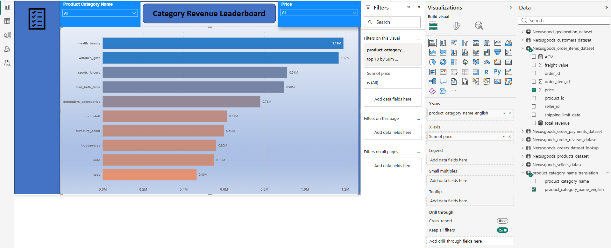
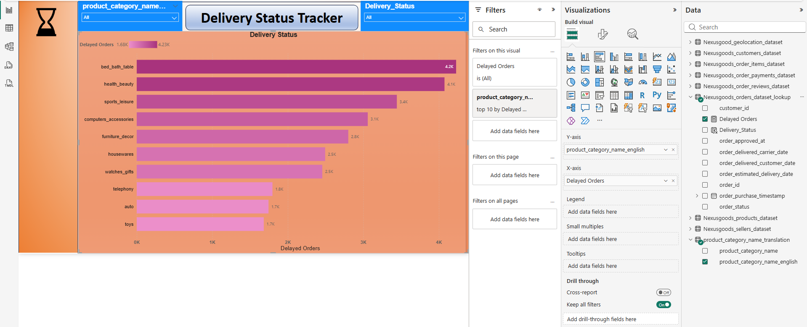
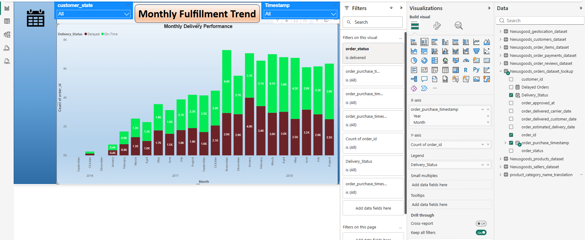
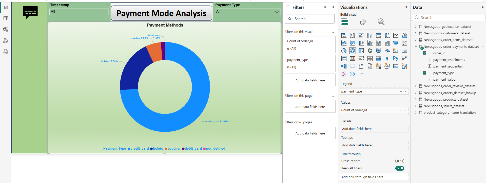
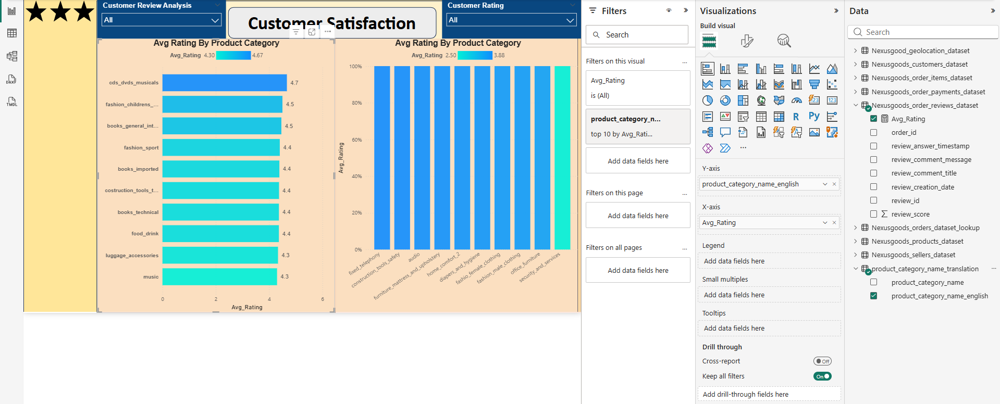
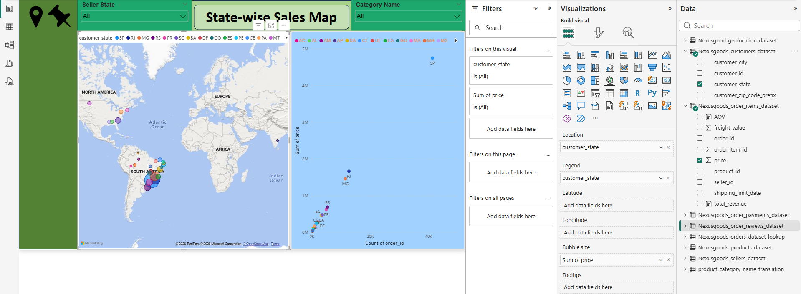
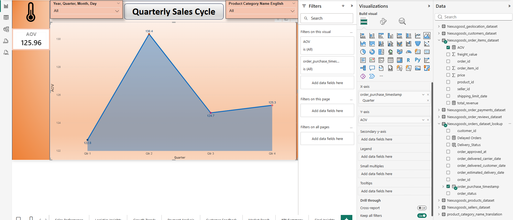
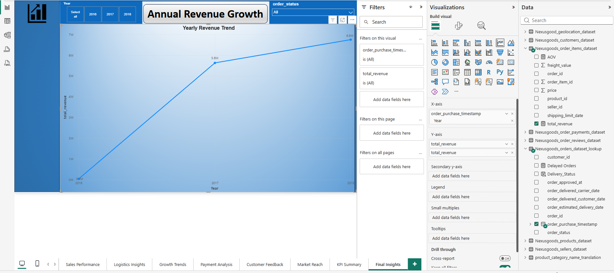

# ShopNest Store Power BI Capstone Project

## Project Overview

This project was developed as part of the SkilloVilla Data Analytics Program.

The dashboard provides insights into:

- Sales Performance
- Customer Analysis
- Product Analysis
- Revenue Trends
- Category Performance
- Monthly Growth Analysis

## Tools Used

- Power BI
- DAX
- Power Query
- Data Modeling
- Excel

## Project Files

### Project Documentation

Contains all 8 business questions, dashboard screenshots, analysis and business insights.

### Power BI Dashboard File

Download Full Project:

https://drive.google.com/file/d/1YOS_hHeJp63apQqoYhug3ZXOfAm_Zc6B/view?usp=sharing

## Dashboard Screenshots

### Task 1

### Task 2

### Task 3

### Task 4

### Task 5

### Task 6

### Task 7

### Task 8

## Skills Demonstrated

- Data Cleaning
- Data Modeling
- DAX
- Dashboard Development
- KPI Reporting
- Data Visualization
- Business Analysis

## Author

### Aman Barthria

LinkedIn:
https://www.linkedin.com/in/aman-barthria-8020a71a0/

GitHub:
https://github.com/AmanBarthria
